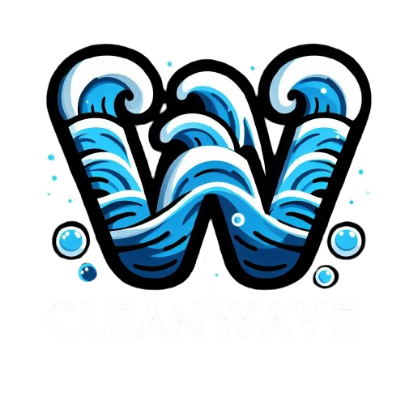

# CleanWaveDNS
- The source C++ code of the CleanWave DNS

# Blocklist
- Create a blocklist file on the same folder as CleanWave
# TODO
- Configuration files
- CleanWave protocol for communicating with web backend.